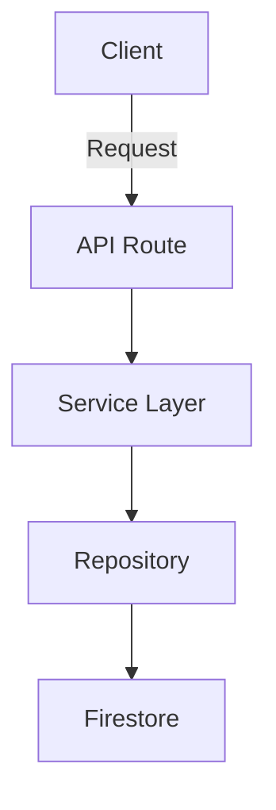

# 📝 Contribuir a la Documentación

Gracias por tu interés en mejorar la documentación de Get Ahead AI. Esta guía te ayudará a contribuir de manera efectiva.

## 🎯 Filosofía de la Documentación

Nuestra documentación debe ser:

- **Clara**: Fácil de entender para todos los niveles
- **Completa**: Cubrir todos los aspectos necesarios
- **Actualizada**: Mantenerse al día con el código
- **Accesible**: Bien organizada y fácil de encontrar
- **Práctica**: Incluir ejemplos reales y código funcional

## 📁 Estructura de Directorios

```
docs/
├── README.md                     # Índice central (NO MODIFICAR estructura)
├── CONTRIBUTING.md              # Esta guía
├── logging.md                   # Guía de logging
│
├── architecture/                # Arquitectura del sistema
├── development/                 # Guías de desarrollo
├── guides/                      # Guías prácticas
├── api/                         # Documentación de APIs
├── frontend/                    # Frontend
├── security/                    # Seguridad
├── ai/                          # AI/ML
├── database/                    # Base de datos
└── operations/                  # Operaciones
```

## 🚀 Cómo Agregar Nueva Documentación

### Paso 1: Identifica la Categoría

Determina dónde encaja tu documentación:

| Categoría       | Contenido                               |
| --------------- | --------------------------------------- |
| `architecture/` | Diseño del sistema, patrones, diagramas |
| `development/`  | Estándares de código, workflow, setup   |
| `guides/`       | Tutoriales paso a paso                  |
| `api/`          | Endpoints, schemas, ejemplos de API     |
| `frontend/`     | Componentes, estilos, estado            |
| `security/`     | Autenticación, autorización, seguridad  |
| `ai/`           | Integración con AI, prompts             |
| `database/`     | Schema, queries, migraciones            |
| `operations/`   | Deployment, monitoring, troubleshooting |

### Paso 2: Usa el Template

Crea tu archivo markdown usando este template:

```markdown
# Título del Documento

## 📋 Introducción

Breve descripción del tema (2-3 oraciones).

## 🎯 Objetivos

- Qué aprenderás
- Qué podrás hacer después

## 📚 Contenido

### Sección Principal

Contenido detallado con explicaciones claras.

### Ejemplos de Código

\`\`\`typescript
// Código con comentarios explicativos
import { logger } from '@/lib/logger';

logger.info('Example log', {
category: LogCategory.SYSTEM_INFO,
// ... más código
});
\`\`\`

### Mejores Prácticas

#### ✅ DO (Hacer)

- Lista de recomendaciones
- Con ejemplos cuando sea posible

#### ❌ DON'T (No Hacer)

- Lista de anti-patrones
- Con explicaciones del por qué

## 🔧 Casos de Uso Comunes

### Caso de Uso 1

Descripción y ejemplo.

### Caso de Uso 2

Descripción y ejemplo.

## 🐛 Troubleshooting

### Problema Común 1

**Síntoma**: Descripción del problema
**Causa**: Por qué ocurre
**Solución**: Cómo resolverlo

## 📚 Referencias

- [Enlace a documentación relacionada](./otra-doc.md)
- [Recurso externo](https://ejemplo.com)

---

[← Volver a Documentación](../README.md)
```

### Paso 3: Sigue las Convenciones

#### Nombres de Archivo

- Usa `kebab-case`: `my-document.md`
- Sé descriptivo: `authentication-flow.md` en lugar de `auth.md`
- No uses espacios ni caracteres especiales

#### Formato

- **Títulos**: Usa `Title Case` para títulos principales
- **Subtítulos**: Usa `Sentence case` para subtítulos
- **Código**: Siempre especifica el lenguaje en los bloques de código
- **Enlaces**: Usa rutas relativas para enlaces internos

#### Emojis para Secciones

Usa emojis consistentes para mejorar la legibilidad:

- 📋 Introducción / Overview
- 🎯 Objetivos / Goals
- 📚 Contenido / Content
- 💡 Ejemplos / Examples
- ✅ Mejores Prácticas / Best Practices
- ❌ Anti-patrones / Don't Do
- 🔧 Casos de Uso / Use Cases
- 🐛 Troubleshooting
- 📊 Diagramas / Charts
- 🚀 Getting Started
- 📝 Referencias / References
- ⚠️ Advertencias / Warnings
- 💭 Notas / Notes

### Paso 4: Agrega al Índice

Actualiza el archivo `docs/README.md` agregando el enlace a tu nuevo documento en la sección apropiada:

```markdown
### 🏗️ Arquitectura y Desarrollo

- **[Logging System](./logging.md)** - Sistema de logging estructurado
- **[Tu Nuevo Documento](./category/tu-documento.md)** - Breve descripción
```

### Paso 5: Incluye Ejemplos Prácticos

Siempre que sea posible:

1. **Código Real**: Usa ejemplos del proyecto actual
2. **Completo**: El código debe ser ejecutable
3. **Comentado**: Explica las partes importantes
4. **Casos de Error**: Muestra cómo manejar errores

**Ejemplo Bueno**:

```typescript
import { logger, LogCategory } from '@/lib/logger';

/**
 * Example: Logging an API request
 */
export async function handleRequest(req: Request) {
  const requestId = generateRequestId();

  try {
    // Log the incoming request
    logger.info('API request received', {
      category: LogCategory.API_REQUEST,
      requestId,
      method: req.method,
      path: req.url,
    });

    // ... process request ...

    // Log successful response
    logger.info('Request completed successfully', {
      category: LogCategory.API_RESPONSE,
      requestId,
      statusCode: 200,
    });
  } catch (error) {
    // Log error with full context
    logger.error('Request failed', {
      category: LogCategory.API_ERROR,
      requestId,
      error: error.message,
      stack: error.stack,
    });
    throw error;
  }
}
```

**Ejemplo Malo**:

```typescript
// Sin contexto ni explicación
logger.info('Something happened');
```

## 📸 Agregando Diagramas

Para diagramas, puedes usar:

### 1. Mermaid (Recomendado)



### 2. ASCII Art (Para diagramas simples)

```
┌─────────────┐
│   Client    │
└─────┬───────┘
      │
      ▼
┌─────────────┐
│  API Route  │
└─────┬───────┘
      │
      ▼
┌─────────────┐
│   Service   │
└─────────────┘
```

### 3. Imágenes (Último recurso)

Guarda imágenes en `docs/images/` y referéncialas:

```markdown

```

## ✅ Checklist de Calidad

Antes de considerar completa tu documentación, verifica:

- [ ] **Título claro** que describe el contenido
- [ ] **Introducción** que explica el propósito
- [ ] **Al menos 2 ejemplos** de código funcional
- [ ] **Sección de mejores prácticas** con DO/DON'T
- [ ] **Troubleshooting** con problemas comunes
- [ ] **Enlaces** verificados y funcionando
- [ ] **Código formateado** correctamente
- [ ] **Sin errores** de ortografía o gramática
- [ ] **Actualizado** en el índice principal (README.md)
- [ ] **Navegación** con enlace de vuelta al inicio

## 🔄 Actualizando Documentación Existente

Cuando actualices documentación:

1. **Mantén la estructura**: No cambies la organización sin discutirlo
2. **Versiona cambios importantes**: Menciona qué cambió y por qué
3. **Actualiza fecha**: Agrega "Última actualización" al final
4. **Verifica enlaces**: Asegúrate que los enlaces sigan funcionando

## 🎨 Estilo de Escritura

### Tono

- **Claro y directo**: Evita jerga innecesaria
- **Amigable pero profesional**: Usa "nosotros", no "yo"
- **Orientado a la acción**: "Haz esto" en lugar de "Podrías hacer esto"

### Estructura de Oraciones

- Usa listas cuando sea posible
- Mantén párrafos cortos (3-4 líneas máximo)
- Una idea por oración
- Usa voz activa

### Código

- Usa TypeScript para todos los ejemplos
- Incluye imports necesarios
- Agrega comentarios explicativos
- Muestra el resultado esperado

## 📋 Plantillas Rápidas

### Para una Guía Tutorial

```markdown
# Guía: [Título]

## 🎯 Lo que construirás

Descripción breve del resultado final.

## 📋 Prerrequisitos

- Requisito 1
- Requisito 2

## 🚀 Paso 1: [Nombre del Paso]

Explicación + código.

## 🚀 Paso 2: [Nombre del Paso]

Explicación + código.

## ✅ Resultado Final

Muestra el resultado completo.

## 🎉 Próximos Pasos

- Qué hacer después
- Lecturas relacionadas
```

### Para Referencia de API

```markdown
# API: [Nombre]

## Descripción

Qué hace esta API.

## Endpoint

\`\`\`
METHOD /api/path
\`\`\`

## Parámetros

| Nombre | Tipo   | Requerido | Descripción |
| ------ | ------ | --------- | ----------- |
| param1 | string | Sí        | Descripción |

## Request

\`\`\`typescript
// Ejemplo de request
\`\`\`

## Response

\`\`\`typescript
// Ejemplo de response
\`\`\`

## Errores

| Código | Descripción | Solución |
| ------ | ----------- | -------- |
| 400    | Bad Request | ...      |
```

## 💡 Tips Finales

1. **Lee documentación existente** para mantener consistencia
2. **Pide feedback** antes de finalizar documentos grandes
3. **Usa imágenes/diagramas** para conceptos complejos
4. **Actualiza regularmente** cuando el código cambie
5. **Piensa en el lector**: ¿Qué necesita saber?

## 🤝 Proceso de Review

1. Crea tu documentación
2. Verifica con el checklist
3. Haz commit con mensaje descriptivo:

   ```
   docs: add guide for [topic]

   - Added comprehensive guide
   - Included code examples
   - Updated main README index
   ```

4. Crea Pull Request (si aplica)
5. Incorpora feedback

## 📞 ¿Necesitas Ayuda?

Si tienes preguntas sobre cómo documentar algo:

1. Revisa documentos similares existentes
2. Consulta esta guía
3. Pregunta al equipo de desarrollo

---

**¡Gracias por contribuir a mejorar nuestra documentación!** 🎉
