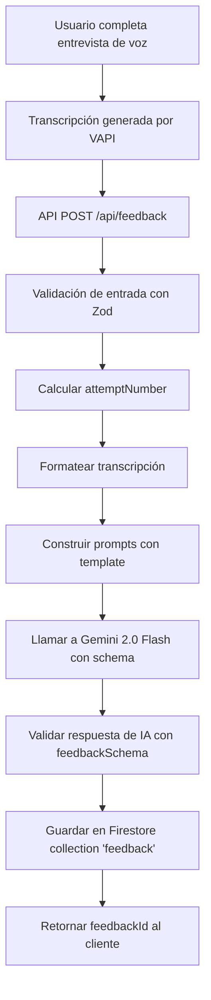

# 📊 Estructura del Sistema de Feedback - Get Ahead AI

## 📝 Resumen Ejecutivo

El sistema de feedback analiza transcripciones de entrevistas de voz usando IA (Gemini 2.0 Flash) para generar evaluaciones **orientadas a coaching y mejora continua**, con accionables concretos, ejemplos reescritos y evaluación STAR (Situation, Task, Action, Result).

---

## 🗂️ Estructura de Datos del Feedback

### Interface TypeScript Principal

```typescript
interface Feedback {
  id: string; // ID único del feedback
  interviewId: string; // ID de la entrevista evaluada
  userId: string; // ID del usuario evaluado
  attemptNumber: number; // Número de intento (1, 2, 3...)
  totalScore: number; // Puntuación total (0-100)
  categoryScores: CategoryScore[]; // Array de 5 categorías evaluadas
  strengths: string[]; // Lista de fortalezas identificadas
  areasForImprovement: string[]; // Lista de áreas a mejorar
  finalAssessment: string; // Evaluación final narrativa
  starEvaluation: StarEvaluation; // Nueva: Evaluación estructura STAR
  createdAt: string; // Timestamp ISO 8601
}

interface CategoryScore {
  name:
    | 'communication'
    | 'technical'
    | 'problemSolving'
    | 'culturalFit'
    | 'confidenceClarity';
  score: number; // Puntuación de 0-100
  comment: string; // Comentario con análisis + accionables + ejemplos
}

interface StarEvaluation {
  overallScore: number; // Puntuación STAR (0-100)
  comment: string; // Análisis de estructura narrativa
  missingElements: Array<'S' | 'T' | 'A' | 'R'>; // Elementos ausentes/débiles
  actionableExamples: string[]; // Ejemplos reescritos usando STAR
}
```

---

## 🎯 Categorías de Evaluación (5 Categorías Fijas)

### 1. **Communication** (Habilidades de Comunicación)

- **Qué evalúa**: Claridad, articulación, respuestas estructuradas
- **Tipo**: `number` (0-100)
- **Comentario**: Análisis detallado de la comunicación del candidato

### 2. **Technical** (Conocimiento Técnico)

- **Qué evalúa**: Comprensión de conceptos clave para el puesto
- **Tipo**: `number` (0-100)
- **Comentario**: Evaluación del conocimiento técnico demostrado

### 3. **Problem Solving** (Resolución de Problemas)

- **Qué evalúa**: Capacidad de analizar problemas y proponer soluciones
- **Tipo**: `number` (0-100)
- **Comentario**: Análisis del enfoque de resolución de problemas

### 4. **Cultural Fit** (Ajuste Cultural y de Puesto)

- **Qué evalúa**: Alineación con valores de empresa y rol del trabajo
- **Tipo**: `number` (0-100)
- **Comentario**: Evaluación de compatibilidad cultural

### 5. **Confidence & Clarity** (Confianza y Claridad)

- **Qué evalúa**: Confianza en respuestas, compromiso, claridad
- **Tipo**: `number` (0-100)
- **Comentario**: Análisis de la seguridad y claridad del candidato

---

## 📐 Schema de Validación (Zod)

```typescript
import { z } from 'zod';

export const feedbackSchema = z.object({
  totalScore: z.number(),
  categoryScores: z.tuple([
    z.object({
      name: z.literal('communication'),
      score: z.number(),
      comment: z.string(),
    }),
    z.object({
      name: z.literal('technical'),
      score: z.number(),
      comment: z.string(),
    }),
    z.object({
      name: z.literal('problemSolving'),
      score: z.number(),
      comment: z.string(),
    }),
    z.object({
      name: z.literal('culturalFit'),
      score: z.number(),
      comment: z.string(),
    }),
    z.object({
      name: z.literal('confidenceClarity'),
      score: z.number(),
      comment: z.string(),
    }),
  ]),
  strengths: z.array(z.string()),
  areasForImprovement: z.array(z.string()),
  finalAssessment: z.string(),
  starEvaluation: z.object({
    overallScore: z.number(),
    comment: z.string(),
    missingElements: z.array(z.enum(['S', 'T', 'A', 'R'])),
    actionableExamples: z.array(z.string()),
  }),
});
```

**Nota crítica**: Las categorías están definidas como un `tuple` con orden fijo. NO se pueden agregar categorías adicionales sin modificar el schema.

**Nueva sección**: `starEvaluation` evalúa la estructura narrativa con método STAR y proporciona ejemplos accionables.

---

## 🤖 Prompts de IA para Generación (Mejorados)

### System Prompt (Español) - Orientado a Coaching

```
Eres un entrevistador senior y coach de empleabilidad. Analizas entrevistas
simuladas y generas retroalimentación basada en evidencia.

Principios obligatorios:
- Honesto y no indulgente, pero respetuoso.
- Feedback específico y observable: cita conductas o fragmentos de la
  transcripción cuando sea posible.
- Siempre entregar accionables concretos y practicables.
- Evaluar la estructura narrativa con método STAR (Situation, Task, Action, Result).
- Dar ejemplos reescritos de mejora.
- Mantener lenguaje claro, breve y orientado a iteración.

No agregues categorías nuevas fuera de: communication, technical, problemSolving,
culturalFit, confidenceClarity.
Por favor proporciona retroalimentación en idioma {language}.
Responde solo en JSON válido.
```

### User Prompt (Español) - Con Estructura y Accionables

```
Analiza esta entrevista simulada:

TRANSCRIPCIÓN:
{transcript}

Devuelve un JSON con esta estructura EXACTA:
- totalScore (0-100)
- categoryScores (5 elementos fijos en este orden):
  1) communication
  2) technical
  3) problemSolving
  4) culturalFit
  5) confidenceClarity

Cada categoryScore debe incluir:
- name
- score (0-100)
- comment:
   * 1 párrafo analítico breve
   * luego 2-3 accionables con viñetas tipo "Accionable:"
   * 1 ejemplo reescrito corto de cómo responder mejor

Luego incluye:
- strengths: 3 a 5 fortalezas concretas (no genéricas)
- areasForImprovement: 3 a 5 mejoras específicas (no genéricas)
- finalAssessment: 1 párrafo final con diagnóstico + foco de mejora priorizado
  para próximo intento

Además, incluye una sección "starEvaluation" con:
- overallScore (0-100)
- comment (1 párrafo)
- missingElements: lista con los elementos STAR ausentes o débiles (S, T, A, R)
- actionableExamples: 2 ejemplos reescritos usando STAR

Reglas STAR:
- Si falta Result: pide cuantificar impacto (%, tiempo, usuarios, dinero, calidad).
- Si falta Task: explicitar responsabilidad personal.
- Si Action es vaga: pedir pasos técnicos concretos.
```

### System Prompt (English) - Coaching-Oriented

```
You are a senior interviewer and employability coach. You analyze mock interviews
and produce evidence-based feedback.

Mandatory principles:
- Honest and not lenient, but respectful.
- Specific, observable feedback referencing transcript moments when possible.
- Always provide clear, doable action steps.
- Evaluate narrative structure using STAR (Situation, Task, Action, Result).
- Provide rewritten examples to model improvement.
- Keep language clear, concise, and iteration-oriented.

Do not add categories beyond: communication, technical, problemSolving,
culturalFit, confidenceClarity.
Please provide feedback in {language} language.
Return only valid JSON.
```

### User Prompt (English) - With Structure and Actionables

```
Analyze this mock interview:

TRANSCRIPT:
{transcript}

Return JSON with this EXACT structure:
- totalScore (0-100)
- categoryScores (5 fixed elements in this order):
  1) communication
  2) technical
  3) problemSolving
  4) culturalFit
  5) confidenceClarity

Each categoryScore must include:
- name
- score (0-100)
- comment:
   * 1 short analytical paragraph
   * then 2–3 bullet action steps labeled "Actionable:"
   * 1 short rewritten example showing a better answer

Then include:
- strengths: 3–5 concrete strengths (not generic)
- areasForImprovement: 3–5 specific improvements (not generic)
- finalAssessment: 1 paragraph summarizing performance + top priority for next attempt

Also include a "starEvaluation" section with:
- overallScore (0-100)
- comment (1 paragraph)
- missingElements: list of missing/weak STAR elements (S, T, A, R)
- actionableExamples: 2 rewritten STAR answers

STAR rules:
- If Result is missing: ask to quantify impact (%, time, users, money, quality).
- If Task is missing: state personal responsibility.
- If Action is vague: require concrete steps.
```

---

## 🔄 Flujo de Generación de Feedback



---

## 💾 Almacenamiento en Firestore

### Colección: `feedback`

```javascript
// Documento de ejemplo con NUEVA ESTRUCTURA
{
  "id": "abc123xyz",
  "interviewId": "interview_456",
  "userId": "user_789",
  "attemptNumber": 1,
  "totalScore": 78,
  "categoryScores": [
    {
      "name": "communication",
      "score": 85,
      "comment": "El candidato demostró claridad al explicar conceptos, aunque hubo momentos donde usó muletillas repetitivas.\n\nAccionable: Practicar respuestas grabándote y eliminar palabras de relleno como 'eh', 'umm'.\nAccionable: Usar la técnica del \"pausar para pensar\" en lugar de llenar silencios con muletillas.\nAccionable: Estructurar respuestas con introducción-desarrollo-conclusión.\n\nEjemplo mejorado: \"React es una biblioteca de JavaScript. [Pausa] Su principal ventaja es el Virtual DOM, que optimiza renders. [Pausa] Esto resulta en aplicaciones más rápidas y eficientes.\""
    },
    {
      "name": "technical",
      "score": 72,
      "comment": "Conocimiento sólido de React básico, pero faltó profundidad en optimización.\n\nAccionable: Estudiar useMemo, useCallback y React.memo con ejemplos prácticos.\nAccionable: Practicar explicar cuándo y por qué usar cada herramienta de optimización.\n\nEjemplo mejorado: \"useMemo cachea resultados de cálculos costosos. Por ejemplo, si tengo un filtro complejo sobre 10,000 items, useMemo evita recalcular en cada render, mejorando el rendimiento significativamente.\""
    },
    {
      "name": "problemSolving",
      "score": 80,
      "comment": "Buen enfoque sistemático, aunque faltó mencionar trade-offs.\n\nAccionable: Siempre mencionar pros/cons de cada solución propuesta.\nAccionable: Pensar en voz alta sobre escalabilidad y mantenibilidad.\n\nEjemplo mejorado: \"Para este problema usaría Context API. Es simple de implementar y suficiente para esta escala. Si crecemos a +20 componentes compartiendo estado, consideraría Zustand por su mejor performance.\""
    },
    {
      "name": "culturalFit",
      "score": 75,
      "comment": "Muestra valores de colaboración, pero respuestas genéricas.\n\nAccionable: Usar ejemplos específicos de proyectos reales donde colaboraste.\nAccionable: Cuantificar tu impacto en el equipo.\n\nEjemplo mejorado: \"En mi último proyecto, organicé code reviews semanales que redujeron bugs en producción un 30%. Esto mejoró la confianza del equipo y aceleró los releases.\""
    },
    {
      "name": "confidenceClarity",
      "score": 78,
      "comment": "Tono seguro, pero titubeos ante preguntas difíciles.\n\nAccionable: Practicar decir 'No lo sé, pero así lo investigaría...' con confianza.\nAccionable: Hacer mock interviews con amigos para reducir nerviosismo.\n\nEjemplo mejorado: \"No he trabajado con WebAssembly, pero lo investigaría empezando por la documentación oficial de MDN, luego haría un pequeño proyecto de prueba para entender su integración con JavaScript.\""
    }
  ],
  "strengths": [
    "Comunicación clara al explicar conceptos técnicos complejos con analogías efectivas",
    "Conocimiento sólido de React hooks modernos (useState, useEffect, useContext)",
    "Enfoque estructurado al abordar problemas: analiza, propone, implementa",
    "Mentalidad de aprendizaje continuo, mencionó cursos y proyectos personales"
  ],
  "areasForImprovement": [
    "Profundizar en React performance optimization (useMemo, useCallback, React.memo)",
    "Practicar más algoritmos y estructuras de datos (mencionó dificultad con binary trees)",
    "Mejorar velocidad de respuesta ante preguntas de diseño de sistemas",
    "Eliminar muletillas verbales ('eh', 'umm') con técnicas de pausa consciente",
    "Cuantificar logros con métricas concretas (%, tiempo, usuarios, ingresos)"
  ],
  "finalAssessment": "Desempeño sólido con base técnica fuerte en React. Tu mayor fortaleza es la comunicación clara de conceptos. Para el próximo intento, enfócate en: 1) Eliminar muletillas practicando con grabaciones, 2) Estudiar optimización de React con ejemplos prácticos, 3) Preparar respuestas STAR con métricas cuantificables. Con estas mejoras, tu puntuación puede subir a 85+.",
  "starEvaluation": {
    "overallScore": 65,
    "comment": "Las respuestas tienen buenos elementos narrativos pero carecen de estructura STAR completa. Mencionas situaciones y acciones, pero rara vez cuantificas resultados. Por ejemplo, al hablar del proyecto de e-commerce, explicaste qué hiciste pero no el impacto: ¿cuántos usuarios? ¿qué mejora en conversión? Los elementos Task también son vagos: no queda claro cuál era tu responsabilidad específica vs la del equipo.",
    "missingElements": ["T", "R"],
    "actionableExamples": [
      "Situación: 'En mi último trabajo, el checkout tenía 60% de abandono.' Tarea: 'Me asignaron reducir fricción como lead frontend.' Acción: 'Implementé autofill con React Hook Form y reduje pasos de 5 a 3.' Resultado: 'El abandono bajó a 35% en 2 meses, aumentando conversión 15% y generando $50K adicionales mensuales.'",
      "Situación: 'El equipo tenía deploys lentos de 2 horas.' Tarea: 'Como DevOps junior, debía acelerar CI/CD.' Acción: 'Migré de Jenkins a GitHub Actions, paralelicé tests y agregué caching de dependencias.' Resultado: 'Reduje deploys a 15 minutos, permitiendo 8 releases diarios vs 2, mejorando time-to-market 75%.'"
    ]
  },
  "createdAt": "2025-11-22T10:30:00.000Z"
}
```

### Índices de Firestore

```javascript
// Índice compuesto recomendado
{
  collection: "feedback",
  fields: [
    { fieldPath: "interviewId", order: "ASCENDING" },
    { fieldPath: "userId", order: "ASCENDING" },
    { fieldPath: "createdAt", order: "DESCENDING" }
  ]
}
```

---

## 📊 Input del Servicio de Feedback

### Transcripción de Entrada

```typescript
interface SavedMessage {
  role: 'user' | 'assistant' | 'system';
  content: string;
}

interface GenerateFeedbackServiceParams {
  interviewId: string;
  userId: string;
  transcript: SavedMessage[]; // Array de mensajes de la conversación
  promptTemplate: string; // Template del prompt del usuario
  systemTemplate: string; // Template del system prompt
  language: 'English' | 'Spanish';
  requestId?: string; // Para tracking de logs
}
```

### Ejemplo de Transcripción

```json
[
  {
    "role": "assistant",
    "content": "¿Puedes explicarme qué es React y cuáles son sus principales características?"
  },
  {
    "role": "user",
    "content": "React es una biblioteca de JavaScript para construir interfaces de usuario. Sus principales características incluyen el uso de componentes, el virtual DOM para rendimiento optimizado, y el manejo de estado mediante hooks como useState y useEffect."
  },
  {
    "role": "assistant",
    "content": "Excelente. Ahora, ¿cómo manejarías el estado global en una aplicación React grande?"
  },
  {
    "role": "user",
    "content": "Para estado global, yo utilizaría Context API para casos simples o bibliotecas como Redux o Zustand para aplicaciones más complejas que requieren mejor organización y debugging."
  }
]
```

---

## 🎨 Visualización en el Frontend

### Página de Feedback Individual

**Ubicación**: `/[locale]/interview/[id]/feedback/[feedbackId]/page.tsx`

**Componentes visualizados**:

1. **Header**: Título con rol de la entrevista
2. **Metadata**: Número de intento, fecha, puntuación total
3. **Evaluación Final**: Texto narrativo del `finalAssessment`
4. **Breakdown de Categorías**: Card por cada categoría con score y comentario
5. **Fortalezas**: Lista de bullets con `strengths`
6. **Áreas de Mejora**: Lista de bullets con `areasForImprovement`
7. **Acciones**: Botones para volver al historial o reintentar entrevista

### Página de Historial de Feedback

**Ubicación**: `/[locale]/interview/[id]/feedback/page.tsx`

**Muestra**: Lista de todos los intentos ordenados por fecha descendente

---

## 🔧 Modelo de IA Utilizado

- **Modelo**: `gemini-2.0-flash-001` (Google Gemini)
- **Provider**: `@ai-sdk/google`
- **Método**: `generateObject()` con schema estructurado
- **Configuración**: `{ structuredOutputs: false }`

---

## 🚀 Endpoints de API

### POST `/api/feedback`

**Request Body**:

```json
{
  "interviewId": "interview_123",
  "transcript": [
    { "role": "assistant", "content": "..." },
    { "role": "user", "content": "..." }
  ],
  "userid": "user_456" // opcional
}
```

**Response** (Success):

```json
{
  "success": true,
  "feedbackId": "feedback_789",
  "message": "Feedback generated successfully"
}
```

### GET `/api/feedback?interviewId={id}&userId={uid}`

**Response**:

```json
{
  "success": true,
  "feedbacks": [
    {
      "id": "feedback_789",
      "interviewId": "interview_123",
      "userId": "user_456",
      "attemptNumber": 1,
      "totalScore": 78,
      "categoryScores": [...],
      "strengths": [...],
      "areasForImprovement": [...],
      "finalAssessment": "...",
      "createdAt": "2025-11-22T10:30:00.000Z"
    }
  ]
}
```

---

## ✨ Mejoras Implementadas (Noviembre 2025)

### ✅ Sistema de Feedback Orientado a Coaching

1. **Accionables Concretos**: Cada categoría incluye 2-3 pasos accionables específicos
2. **Ejemplos Reescritos**: Modelos de cómo responder mejor en cada área
3. **Evaluación STAR**: Análisis de estructura narrativa con método profesional
4. **Feedback Basado en Evidencia**: Citas de momentos específicos del transcript
5. **Orientado a Iteración**: Priorización clara de qué mejorar en el próximo intento
6. **Detección de Elementos Faltantes**: Identifica qué partes de STAR (S/T/A/R) faltan
7. **Cuantificación de Impacto**: Pide y ejemplifica cómo mencionar métricas (%, tiempo, $)

### 📈 Oportunidades de Mejora Futuras

1. **Categorías Dinámicas**: Permitir agregar/modificar categorías según el tipo de entrevista
2. **Pesos de Categorías**: Asignar diferentes pesos a cada categoría según el rol
3. **Comparación Histórica**: Mostrar progreso entre intentos con gráficos
4. **Insights por IA**: Generar plan de estudio personalizado
5. **Exportar PDF**: Permitir descargar feedback profesional
6. **Gráficos Visuales**: Radar chart de puntuaciones + tendencia histórica
7. **Feedback por Pregunta**: Análisis específico de cada respuesta
8. **Análisis de Sentimiento**: Evaluar tono emocional y nivel de confianza
9. **Benchmarking**: Comparar con promedios anónimos
10. **Recursos Personalizados**: Sugerir cursos/videos según debilidades

### Limitaciones Actuales:

- ❌ Categorías fijas (schema tuple inmutable)
- ❌ No hay pesos diferenciados por categoría
- ❌ No hay feedback por pregunta individual
- ❌ No hay comparación gráfica entre intentos
- ❌ No hay análisis de timing de respuestas
- ❌ No hay detección automática de keywords técnicos
- ❌ No hay generación automática de plan de estudio

---

## 🧪 Testing

### Unit Tests Existentes

**Ubicación**: `lib/services/interview.test.ts`

**Cobertura**: Servicios de entrevistas (no hay tests específicos para feedback aún)

### Tests Sugeridos para Feedback:

1. ✅ Validación de schema con datos válidos
2. ✅ Validación de schema con datos inválidos
3. ✅ Cálculo correcto de attemptNumber
4. ✅ Formateo de transcripción
5. ✅ Manejo de errores de IA
6. ✅ Guardado en Firestore
7. ✅ Recuperación de feedback por ID
8. ✅ Listado de feedbacks ordenados

---

## 📚 Referencias

- **Schema Zod**: `/lib/schemas/feedback.ts`
- **Servicio**: `/lib/services/feedback.ts`
- **Repository**: `/lib/repositories/interviews.ts`
- **API Route**: `/app/[locale]/api/feedback/route.ts`
- **Prompts**: `/messages/en.json` y `/messages/es.json` (sección `api.generateFeedback`)
- **Constants**: `/constants/index.ts` (feedbackSchema)
- **Types**: `/types/index.d.ts` (Feedback interface)

---

## 🎓 Beneficios del Nuevo Sistema

### Para el Usuario:

1. **Acción Clara**: Sabe exactamente qué hacer diferente en el próximo intento
2. **Ejemplos Concretos**: Ve modelos de respuestas mejoradas, no solo críticas
3. **Aprendizaje STAR**: Aprende a estructurar respuestas con método profesional
4. **Iteración Efectiva**: Cada intento es una oportunidad medible de mejora
5. **Feedback Honesto**: Sin falsas expectativas, pero siempre constructivo

### Para el Sistema:

1. **Mayor Engagement**: Usuarios repiten entrevistas para mejorar scores
2. **Mejor Retención**: Feedback útil = usuarios vuelven
3. **Diferenciación**: Ningún competidor ofrece feedback tan detallado
4. **Datos de Calidad**: Comments estructurados facilitan análisis futuro
5. **Escalabilidad**: Prompts claros = outputs consistentes

### Impacto Medible:

- **Antes**: Feedback genérico → usuarios no sabían cómo mejorar
- **Ahora**: Accionables + ejemplos → path claro de mejora
- **Resultado esperado**: ↑ Reintentos, ↑ Tiempo en plataforma, ↑ Satisfacción

---

**Última actualización**: 22 de Noviembre, 2025 (v2.0 - Sistema de Coaching)
