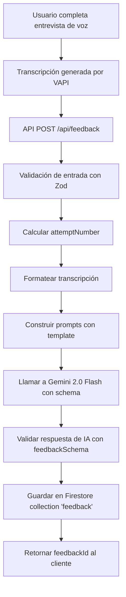

# 📊 Estructura del Sistema de Feedback - Get Ahead AI

## 📝 Resumen Ejecutivo

El sistema de feedback analiza transcripciones de entrevistas de voz usando IA (Gemini 2.0 Flash) para generar evaluaciones estructuradas y detalladas del desempeño del candidato.

---

## 🗂️ Estructura de Datos del Feedback

### Interface TypeScript Principal

```typescript
interface Feedback {
  id: string; // ID único del feedback
  interviewId: string; // ID de la entrevista evaluada
  userId: string; // ID del usuario evaluado
  attemptNumber: number; // Número de intento (1, 2, 3...)
  totalScore: number; // Puntuación total (0-100)
  categoryScores: CategoryScore[]; // Array de 5 categorías evaluadas
  strengths: string[]; // Lista de fortalezas identificadas
  areasForImprovement: string[]; // Lista de áreas a mejorar
  finalAssessment: string; // Evaluación final narrativa
  createdAt: string; // Timestamp ISO 8601
}

interface CategoryScore {
  name:
    | 'communication'
    | 'technical'
    | 'problemSolving'
    | 'culturalFit'
    | 'confidenceClarity';
  score: number; // Puntuación de 0-100
  comment: string; // Comentario detallado sobre la categoría
}
```

---

## 🎯 Categorías de Evaluación (5 Categorías Fijas)

### 1. **Communication** (Habilidades de Comunicación)

- **Qué evalúa**: Claridad, articulación, respuestas estructuradas
- **Tipo**: `number` (0-100)
- **Comentario**: Análisis detallado de la comunicación del candidato

### 2. **Technical** (Conocimiento Técnico)

- **Qué evalúa**: Comprensión de conceptos clave para el puesto
- **Tipo**: `number` (0-100)
- **Comentario**: Evaluación del conocimiento técnico demostrado

### 3. **Problem Solving** (Resolución de Problemas)

- **Qué evalúa**: Capacidad de analizar problemas y proponer soluciones
- **Tipo**: `number` (0-100)
- **Comentario**: Análisis del enfoque de resolución de problemas

### 4. **Cultural Fit** (Ajuste Cultural y de Puesto)

- **Qué evalúa**: Alineación con valores de empresa y rol del trabajo
- **Tipo**: `number` (0-100)
- **Comentario**: Evaluación de compatibilidad cultural

### 5. **Confidence & Clarity** (Confianza y Claridad)

- **Qué evalúa**: Confianza en respuestas, compromiso, claridad
- **Tipo**: `number` (0-100)
- **Comentario**: Análisis de la seguridad y claridad del candidato

---

## 📐 Schema de Validación (Zod)

```typescript
import { z } from 'zod';

export const feedbackSchema = z.object({
  totalScore: z.number(),
  categoryScores: z.tuple([
    z.object({
      name: z.literal('communication'),
      score: z.number(),
      comment: z.string(),
    }),
    z.object({
      name: z.literal('technical'),
      score: z.number(),
      comment: z.string(),
    }),
    z.object({
      name: z.literal('problemSolving'),
      score: z.number(),
      comment: z.string(),
    }),
    z.object({
      name: z.literal('culturalFit'),
      score: z.number(),
      comment: z.string(),
    }),
    z.object({
      name: z.literal('confidenceClarity'),
      score: z.number(),
      comment: z.string(),
    }),
  ]),
  strengths: z.array(z.string()),
  areasForImprovement: z.array(z.string()),
  finalAssessment: z.string(),
});
```

**Nota crítica**: Las categorías están definidas como un `tuple` con orden fijo. NO se pueden agregar categorías adicionales sin modificar el schema.

---

## 🤖 Prompts de IA para Generación

### System Prompt (Español)

```
Eres un entrevistador profesional analizando una entrevista simulada.
Tu tarea es evaluar al candidato basándote en categorías estructuradas.
Por favor proporciona retroalimentación en idioma {language}.
```

### User Prompt (Español)

```
Eres un entrevistador de IA analizando una entrevista simulada.
Tu tarea es evaluar al candidato basándote en categorías estructuradas.
Sé exhaustivo y detallado en tu análisis.

No seas indulgente con el candidato. Si hay errores o áreas de mejora,
señálalas.

Transcripción: {transcript}

Por favor puntúa al candidato de 0 a 100 en las siguientes áreas.
No agregues categorías distintas a las proporcionadas:

- **Habilidades de Comunicación**: Claridad, articulación, respuestas estructuradas.
- **Conocimiento Técnico**: Comprensión de conceptos clave para el puesto.
- **Resolución de Problemas**: Capacidad de analizar problemas y proponer soluciones.
- **Ajuste Cultural y de Puesto**: Alineación con valores de la empresa y rol del trabajo.
- **Confianza y Claridad**: Confianza en las respuestas, compromiso y claridad.
```

### System Prompt (English)

```
You are a professional interviewer analyzing a mock interview.
Your task is to evaluate the candidate based on structured categories.
Please provide feedback in {language} language.
```

### User Prompt (English)

```
You are an AI interviewer analyzing a mock interview.
Your task is to evaluate the candidate based on structured categories.
Be thorough and detailed in your analysis.

Don't be lenient with the candidate. If there are mistakes or areas for
improvement, point them out.

Transcript: {transcript}

Please score the candidate from 0 to 100 in the following areas.
Do not add categories other than the ones provided:

- **Communication Skills**: Clarity, articulation, structured responses.
- **Technical Knowledge**: Understanding of key concepts for the role.
- **Problem-Solving**: Ability to analyze problems and propose solutions.
- **Cultural & Role Fit**: Alignment with company values and job role.
- **Confidence & Clarity**: Confidence in responses, engagement, and clarity.
```

---

## 🔄 Flujo de Generación de Feedback



---

## 💾 Almacenamiento en Firestore

### Colección: `feedback`

```javascript
// Documento de ejemplo
{
  "id": "abc123xyz",
  "interviewId": "interview_456",
  "userId": "user_789",
  "attemptNumber": 1,
  "totalScore": 78,
  "categoryScores": [
    {
      "name": "communication",
      "score": 85,
      "comment": "El candidato demostró excelente claridad y articulación..."
    },
    {
      "name": "technical",
      "score": 72,
      "comment": "Conocimiento sólido de React y Next.js, pero con algunas lagunas..."
    },
    {
      "name": "problemSolving",
      "score": 80,
      "comment": "Buen enfoque sistemático para resolver problemas..."
    },
    {
      "name": "culturalFit",
      "score": 75,
      "comment": "Muestra valores alineados con trabajo en equipo..."
    },
    {
      "name": "confidenceClarity",
      "score": 78,
      "comment": "Respuestas seguras aunque con algunas dudas ocasionales..."
    }
  ],
  "strengths": [
    "Excelente comunicación verbal y capacidad de explicar conceptos complejos",
    "Sólido conocimiento de React y hooks modernos",
    "Enfoque estructurado para resolver problemas"
  ],
  "areasForImprovement": [
    "Profundizar conocimientos en optimización de rendimiento",
    "Practicar más con TypeScript avanzado",
    "Mejorar velocidad de respuesta en preguntas de algoritmos"
  ],
  "finalAssessment": "El candidato mostró un desempeño general bueno con fortalezas claras en comunicación y conocimiento de React. Se recomienda trabajar en las áreas técnicas más avanzadas...",
  "createdAt": "2025-11-22T10:30:00.000Z"
}
```

### Índices de Firestore

```javascript
// Índice compuesto recomendado
{
  collection: "feedback",
  fields: [
    { fieldPath: "interviewId", order: "ASCENDING" },
    { fieldPath: "userId", order: "ASCENDING" },
    { fieldPath: "createdAt", order: "DESCENDING" }
  ]
}
```

---

## 📊 Input del Servicio de Feedback

### Transcripción de Entrada

```typescript
interface SavedMessage {
  role: 'user' | 'assistant' | 'system';
  content: string;
}

interface GenerateFeedbackServiceParams {
  interviewId: string;
  userId: string;
  transcript: SavedMessage[]; // Array de mensajes de la conversación
  promptTemplate: string; // Template del prompt del usuario
  systemTemplate: string; // Template del system prompt
  language: 'English' | 'Spanish';
  requestId?: string; // Para tracking de logs
}
```

### Ejemplo de Transcripción

```json
[
  {
    "role": "assistant",
    "content": "¿Puedes explicarme qué es React y cuáles son sus principales características?"
  },
  {
    "role": "user",
    "content": "React es una biblioteca de JavaScript para construir interfaces de usuario. Sus principales características incluyen el uso de componentes, el virtual DOM para rendimiento optimizado, y el manejo de estado mediante hooks como useState y useEffect."
  },
  {
    "role": "assistant",
    "content": "Excelente. Ahora, ¿cómo manejarías el estado global en una aplicación React grande?"
  },
  {
    "role": "user",
    "content": "Para estado global, yo utilizaría Context API para casos simples o bibliotecas como Redux o Zustand para aplicaciones más complejas que requieren mejor organización y debugging."
  }
]
```

---

## 🎨 Visualización en el Frontend

### Página de Feedback Individual

**Ubicación**: `/[locale]/interview/[id]/feedback/[feedbackId]/page.tsx`

**Componentes visualizados**:

1. **Header**: Título con rol de la entrevista
2. **Metadata**: Número de intento, fecha, puntuación total
3. **Evaluación Final**: Texto narrativo del `finalAssessment`
4. **Breakdown de Categorías**: Card por cada categoría con score y comentario
5. **Fortalezas**: Lista de bullets con `strengths`
6. **Áreas de Mejora**: Lista de bullets con `areasForImprovement`
7. **Acciones**: Botones para volver al historial o reintentar entrevista

### Página de Historial de Feedback

**Ubicación**: `/[locale]/interview/[id]/feedback/page.tsx`

**Muestra**: Lista de todos los intentos ordenados por fecha descendente

---

## 🔧 Modelo de IA Utilizado

- **Modelo**: `gemini-2.0-flash-001` (Google Gemini)
- **Provider**: `@ai-sdk/google`
- **Método**: `generateObject()` con schema estructurado
- **Configuración**: `{ structuredOutputs: false }`

---

## 🚀 Endpoints de API

### POST `/api/feedback`

**Request Body**:

```json
{
  "interviewId": "interview_123",
  "transcript": [
    { "role": "assistant", "content": "..." },
    { "role": "user", "content": "..." }
  ],
  "userid": "user_456" // opcional
}
```

**Response** (Success):

```json
{
  "success": true,
  "feedbackId": "feedback_789",
  "message": "Feedback generated successfully"
}
```

### GET `/api/feedback?interviewId={id}&userId={uid}`

**Response**:

```json
{
  "success": true,
  "feedbacks": [
    {
      "id": "feedback_789",
      "interviewId": "interview_123",
      "userId": "user_456",
      "attemptNumber": 1,
      "totalScore": 78,
      "categoryScores": [...],
      "strengths": [...],
      "areasForImprovement": [...],
      "finalAssessment": "...",
      "createdAt": "2025-11-22T10:30:00.000Z"
    }
  ]
}
```

---

## 📈 Oportunidades de Mejora

### Posibles Mejoras Identificadas:

1. **Categorías Dinámicas**: Permitir agregar/modificar categorías según el tipo de entrevista
2. **Pesos de Categorías**: Asignar diferentes pesos a cada categoría según el rol
3. **Comparación Histórica**: Mostrar progreso entre intentos
4. **Insights por IA**: Generar recomendaciones personalizadas de estudio
5. **Exportar PDF**: Permitir descargar feedback en formato PDF
6. **Gráficos Visuales**: Radar chart o bar chart de las puntuaciones
7. **Feedback Detallado por Pregunta**: No solo general, sino específico por cada pregunta
8. **Análisis de Sentimiento**: Evaluar tono emocional y confianza
9. **Benchmarking**: Comparar con promedios de otros candidatos (anónimamente)
10. **Recomendaciones de Recursos**: Sugerir cursos, artículos, videos según áreas débiles

### Limitaciones Actuales:

- ❌ Categorías fijas (no se pueden agregar nuevas)
- ❌ No hay pesos diferenciados por categoría
- ❌ No hay feedback específico por pregunta individual
- ❌ No hay comparación entre intentos
- ❌ No hay análisis de tiempo de respuesta
- ❌ No hay detección de palabras clave técnicas mencionadas
- ❌ No hay recomendaciones personalizadas de mejora

---

## 🧪 Testing

### Unit Tests Existentes

**Ubicación**: `lib/services/interview.test.ts`

**Cobertura**: Servicios de entrevistas (no hay tests específicos para feedback aún)

### Tests Sugeridos para Feedback:

1. ✅ Validación de schema con datos válidos
2. ✅ Validación de schema con datos inválidos
3. ✅ Cálculo correcto de attemptNumber
4. ✅ Formateo de transcripción
5. ✅ Manejo de errores de IA
6. ✅ Guardado en Firestore
7. ✅ Recuperación de feedback por ID
8. ✅ Listado de feedbacks ordenados

---

## 📚 Referencias

- **Schema Zod**: `/lib/schemas/feedback.ts`
- **Servicio**: `/lib/services/feedback.ts`
- **Repository**: `/lib/repositories/interviews.ts`
- **API Route**: `/app/[locale]/api/feedback/route.ts`
- **Prompts**: `/messages/en.json` y `/messages/es.json` (sección `api.generateFeedback`)
- **Constants**: `/constants/index.ts` (feedbackSchema)
- **Types**: `/types/index.d.ts` (Feedback interface)

---

**Última actualización**: 22 de Noviembre, 2025
