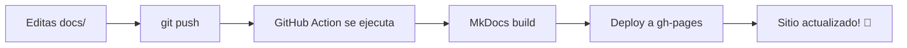

# ⚡ Quick Start - Ver tu Documentación

## 🎯 3 Formas de Ver la Documentación (Elige Una)

### 1️⃣ GitHub (Ya Funciona) ✅

```
https://github.com/[tu-usuario]/get-ahead-ai/tree/main/docs
```

**Acción necesaria**: Ninguna, solo push tu código

---

### 2️⃣ GitHub Pages + MkDocs (⭐ Recomendado)

```
https://[tu-usuario].github.io/get-ahead-ai/
```

**Pasos**:

1. **Habilitar GitHub Pages**:

   - Ve a tu repo en GitHub
   - Click en `Settings`
   - Click en `Pages` (menú izquierdo)
   - En `Source`: selecciona `Deploy from a branch`
   - En `Branch`: selecciona `gh-pages` (si no existe, se creará automáticamente)
   - Click `Save`

2. **Push tu código**:

   ```bash
   git add .
   git commit -m "docs: setup documentation center"
   git push
   ```

3. **Espera 1-2 minutos**
   - El GitHub Action se ejecutará automáticamente
   - Tu sitio estará en: `https://[tu-usuario].github.io/get-ahead-ai/`

**Listo!** ✨ Cada vez que hagas push con cambios en `docs/`, se desplegará automáticamente.

---

### 3️⃣ Preview Local con MkDocs

```bash
# Instalar MkDocs
pip install mkdocs-material

# Ejecutar servidor local
mkdocs serve

# Abrir en navegador
# http://127.0.0.1:8000
```

---

## 📁 Archivos Importantes

```
get-ahead-ai/
├── mkdocs.yml                    # ✅ Configuración de MkDocs
├── .github/
│   └── workflows/
│       └── docs.yml             # ✅ GitHub Action (deploy automático)
├── docs/
│   ├── index.md                 # ✅ Página de inicio
│   ├── logging.md               # ✅ Tu documentación
│   ├── DEPLOYMENT.md            # ✅ Guía completa
│   ├── VIEWING_OPTIONS.md       # ✅ Este archivo
│   └── ...                      # ✅ Resto de docs
└── .gitignore                   # ✅ Ignora /site/
```

---

## 🔧 Workflow Automático



1. **Editas** archivos en `docs/`
2. **Push** a GitHub
3. **GitHub Action** detecta cambios
4. **MkDocs** genera sitio estático
5. **Deploy** automático a branch `gh-pages`
6. **Tu sitio** se actualiza en 1-2 minutos

---

## 🎨 Cómo se ve

### GitHub Pages + MkDocs:

```
┌─────────────────────────────────────────────┐
│  🏠 Get Ahead AI - Documentation            │
├─────────────────────────────────────────────┤
│  📖 Guías  |  🔧 APIs  |  🔐 Security      │
├─────────────────────────────────────────────┤
│                                             │
│  📝 Contenido de tu documentación          │
│  Con código syntax highlighting            │
│  Con búsqueda 🔍                           │
│  Con dark mode 🌓                          │
│  Con navegación fluida ⚡                  │
│                                             │
└─────────────────────────────────────────────┘
```

### GitHub Nativo:

```
┌─────────────────────────────────────────────┐
│  GitHub Repository                          │
├─────────────────────────────────────────────┤
│  📁 docs/                                   │
│    📄 README.md (renderizado)              │
│    📄 logging.md                           │
│    📁 architecture/                         │
│    ...                                      │
└─────────────────────────────────────────────┘
```

---

## ✅ Checklist

Para GitHub Pages + MkDocs:

- [ ] Código pusheado a GitHub
- [ ] Settings → Pages → Source → gh-pages
- [ ] Esperé 1-2 minutos
- [ ] Visité `https://[usuario].github.io/get-ahead-ai/`
- [ ] ¡Funciona! 🎉

---

## 🐛 Si algo no funciona

### "No veo mi sitio en GitHub Pages"

1. Verifica que GitHub Pages esté habilitado
2. Ve a `Actions` tab y verifica que el workflow corrió
3. Espera 2-3 minutos más

### "El Action falló"

1. Ve a Actions → Click en el workflow fallido
2. Revisa los logs
3. Usualmente es un problema de permisos:
   - Settings → Actions → General
   - Workflow permissions → "Read and write permissions"

### "Los cambios no aparecen"

1. Limpia caché del navegador (Ctrl+Shift+R)
2. Verifica que el Action haya corrido después de tu push
3. Dale 1-2 minutos para propagación

---

## 📚 Más Info

- [Guía Completa de Deployment](./DEPLOYMENT.md)
- [Opciones de Visualización](./VIEWING_OPTIONS.md)
- [Guía de Contribución](./CONTRIBUTING.md)

---

**¿Prefieres algo más simple?** Usa GitHub nativo, ya funciona sin configuración!

**¿Quieres algo profesional?** Usa MkDocs + GitHub Pages, ya está todo configurado!

---

[← Volver a Documentación](./README.md)
